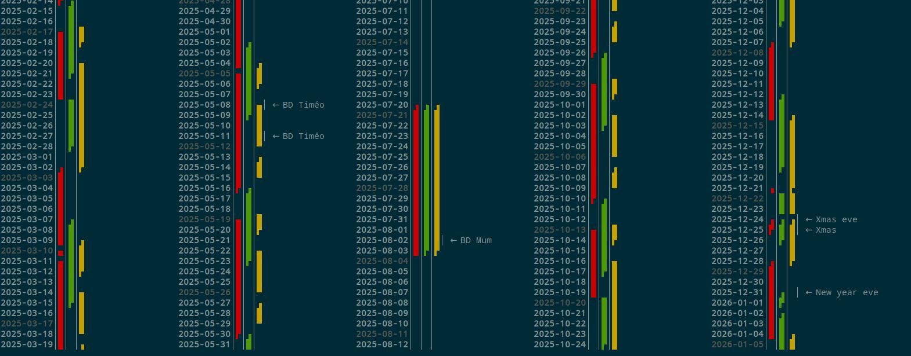
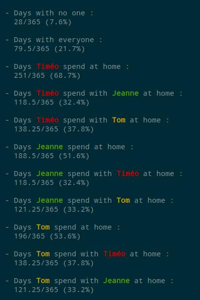
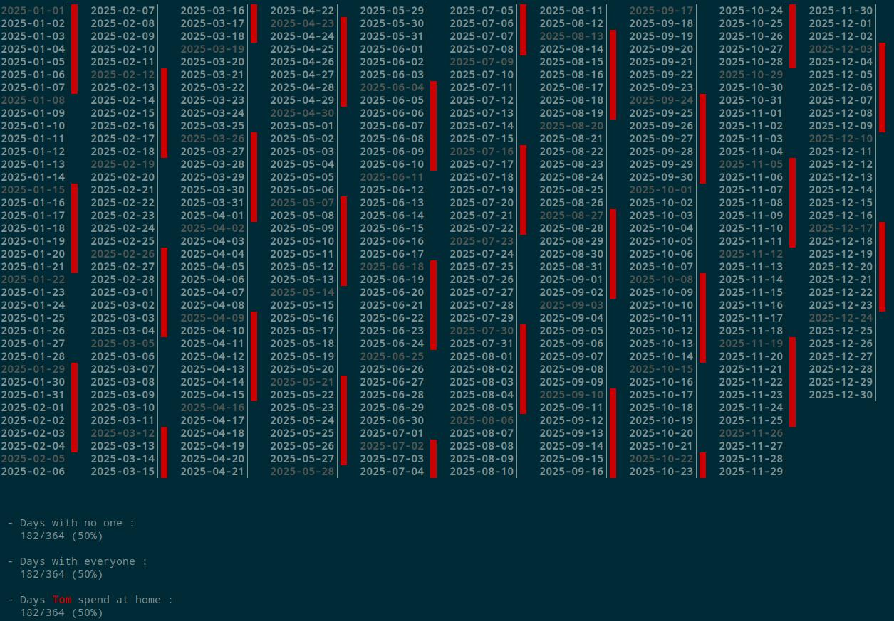

# Parental custody planning helper

TUI utility that generate report to help sync multiple custodies and help find the best custody solution depending on multiple parameters.

## usage 

run 
```
php report.php [path_to_yaml] [optional:nb_columns]
php report.php config.dev/config.yml 2
```






## configuration

Your config file may contain as many calendars as you want. All of them with their own settings.

### Minimal config

```YML
calendars:
  - name: Tom
    models:
      - name: normal
        days: >
          ++++ ++++ ++++ ++++ ++++ ++++ ++++
          ---- ---- ---- ---- ---- ---- ----
    periods:
      "2025-01-06": normal
      "2026-01-06": _end_
    exceptions: []

important_days: []

```

and run 

```
php report.php dev/minimal_config.yml 10
```


### Example config

```yml
calendars:
  - name: Timéo
    models:
      - name: normal
        days: >
          -+++ ++++ ++++ ++++ ++++ ++++ ++++
          ++++ ++++ ++++ ++++ +++- ---- ----
      - name: holidays
        days: >
          ---- ---- ---- ---- ---- ---- ---+
          ++++ ++++ ++++ ++++ ++++ ++++ ++++
      - name: summer_holidays
        days: >
          ---- ---- ---- ---- ---- ---- ----
          ---- ---- ---- ---- ---- ---- ---+
          ++++ ++++ ++++ ++++ ++++ ++++ ++++
          ++++ ++++ ++++ ++++ ++++ ++++ ++++
    periods:
      "2025-01-06": normal
      "2025-02-24": holidays
      "2025-03-10": normal
      "2025-04-21": holidays
      "2025-05-05": normal
      "2025-07-07": summer_holidays
      "2025-09-01": normal
      "2025-10-20": holidays
      "2025-03-11": normal
      "2025-12-22": holidays
      "2026-05-01": normal
      "2026-01-06": _end_
    exceptions:
      "2025-12-24": --++
      "2025-12-25": ++--
  - name: Jeanne
    models:
      - name: normal
        days: >
          ++++ ++++ ++++ ++++ +++- ---- ----
          ---- ---- ---- ---- ---+ ++++ ++++
      - name: holidays
        days: >
          ++++ ++++ ++++ ++++ +++- ---- ----
          ---- ---- ---- ---- ---+ ++++ ++++
      - name: summer_holidays
        days: >
          ---- ---- ---- ---- ---- ---- ----
          ---- ---- ---- ---- ---- ---- ---+
          ++++ ++++ ++++ ++++ ++++ ++++ ++++
          ++++ ++++ ++++ ++++ ++++ ++++ +++-
    periods:
      "2025-01-06": normal
      "2025-02-24": holidays
      "2025-03-10": normal
      "2025-04-21": holidays
      "2025-05-05": normal
      "2025-07-07": summer_holidays
      "2025-09-01": normal
      "2025-10-20": holidays
      "2025-03-11": normal
      "2025-12-22": holidays
      "2026-05-01": normal
      "2026-01-06": _end_
    exceptions:
      "2025-12-24": --++
      "2025-12-25": ++++
      "2025-12-31": --++
      "2026-01-01": ++--
  - name: Tom
    models:
      - name: normal
        days: >
          ++++ +++- ---- -+++ ++++ ++++ ++++
          +--- ---+ ++++ +--- ---- ---- ----
      - name: holidays
        days: >
          ++++ ++++ ++++ ++++ ++++ ++++ +++-
          ---- ---- ---- ---- ---- ---- ---+
      - name: summer_holidays
        days: >
          ---- ---- ---- ---- ---- ---- ----
          ---- ---- ---- ---- ---- ---- ---+
          ++++ ++++ ++++ ++++ ++++ ++++ ++++
          ++++ ++++ ++++ ++++ ++++ ++++ +++-
    periods:
      "2025-01-06": normal
      "2025-02-24": holidays
      "2025-03-10": normal
      "2025-04-21": holidays
      "2025-05-05": normal
      "2025-07-07": summer_holidays
      "2025-09-01": normal
      "2025-10-20": holidays
      "2025-03-11": normal
      "2025-12-22": holidays
      "2026-05-01": normal
      "2026-01-06": _end_
    exceptions:
      "2025-12-24": --++

important_days:
  "2025-12-25": "Xmas"
  "2025-12-24": "Xmas eve"
  "2025-09-11": "BD Dad"
  "2025-08-02": "BD Mum"
  "2025-08-29": "BD Tom"
  "2025-05-08": "BD Timéo"
  "2025-05-11": "BD Timéo"
  "2025-07-09": "BD Jeanne"
  "2025-12-31": "New year eve"

```

### Models

Models set a type of custody.

They are days divided in 4 parts : 
 - night
 - morning
 - afternoon
 - evening

 - `+---` means the child sleeps at home and leave early in the morning
 - `++--` means the child sleeps at home and leave at noon
 - `+++-` means the child sleeps at home and leave at the end of the afternoon
 - `++++` means the child sleeps at home and stays until next night.
 - `----` means the child is away all day
 - `---+` means the child is away and arrives in the evening
 - `--++` means the child is away and arrives at noon
 - `-+++` means the child is away and arrives in the morning
 
You may compose them as you want.

You can, then, compose your model of custody. Examples :

 - `++++ ----` : One day at home, one day away
 - `++++ ++-- ---- ---- --++` : One day at home, leaving at noon, three days away, come back at noon.

You may name it and add it to your config :

```yml
calendars:
  - name: Tom
    models:
      - name: one_day_in_one_day_off
        days: >
          ++++ ----
      - name: one_day_out_of_three
        days: >
          ++++ ++-- ---- ---- --++
```

As many as you want.

Spaces and linebreaks will be trimed. `++++----` is the same as `++++ ----`.

### Periods

After that, you can create periods using models. For example, you may repeat `++++ ----` all year simply with thoses lines : 

```yml
calendars:
  - name: Tom
    models:
      - name: one_day_in_one_day_off
        days: >
          ++++ ++++ ++++ ++++ ++++ ++++ ++++
          ++++ ----
#################
    periods:
      "2025-01-01": one_day_in_one_day_off
      "2025-12-31": _end_
#################      
```
This means that it will repeat `one_day_in_one_day_off` model until the next period.

Info: The next period can be of the same model starting again before the previous is over.

Info: You MUST have an `_end_` period to end you calendar.

### Exceptions

You can add exceptions. Dates that will behave differently without affecting the periods rythme.

```yml
    exceptions:
      "2025-12-24": --++
```

Exception are only one day, so it must contains only 4 chars. Like `++++`

To finish, you can add `important_days` that will be shown in the calendar and in the report (To show the children present that day, and how they are present).

